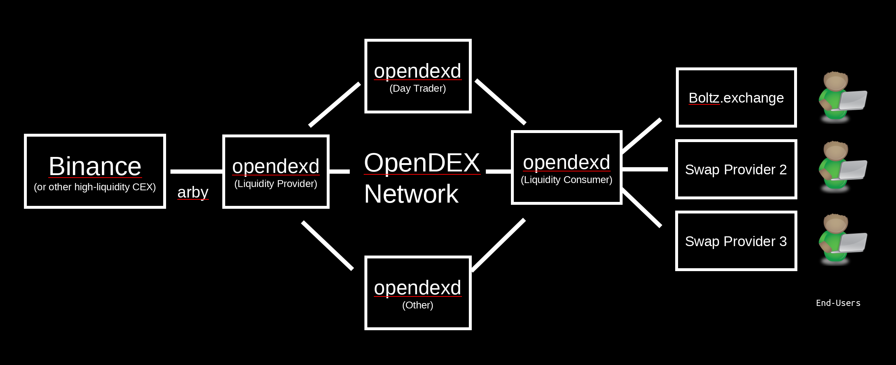

The OpenDEX Daemon ([`opendexd`](https://github.com/opendexnetwork/opendexd)) is "the node" and core of the OpenDEX network. The graphic below shows the different participants in OpenDEX and how they are connected.

## How to Run a Node

👉 as [**Liquidity Provider**](/docs/liquidity-providers.md), earning via automated arbitrage between external exchanges and OpenDEX

👉 as [**Swap Provider**](/docs/swap-providers.md), sourcing liquidity on OpenDEX **(WIP)**

👉 as [**Day Trader**](/docs/day-traders.md), trading instantaneously while preserving full control & privacy

👉 as [**Developer**](/docs/developers.md), contributing or building on top of `opendexd`

## Special Docs
* [Dockerless Guide](/docs/dockerless.md)
* [Close Shop Guide](/docs/close-shop.md)
* [CLI Documentation](/docs/cli.md)
* [Config Documentation](/docs/config.md)

## Support & Community

* [Contribute](/docs/contribute.md)!
* Support and development-related questions are welcome on our [Discord](https://discord.gg/RnXFHpn)!

## Help us to improve!

Please help us to improve by opening issues (or even better PRs) for [opendexd](https://github.com/opendexnetwork/opendexd), [opendex-docker](https://github.com/opendexnetwork/opendex-docker), [opendex-ui](https://github.com/opendexnetwork/opendex-ui) & [opendex-desktop](https://github.com/opendexnetwork/opendex-desktop).
