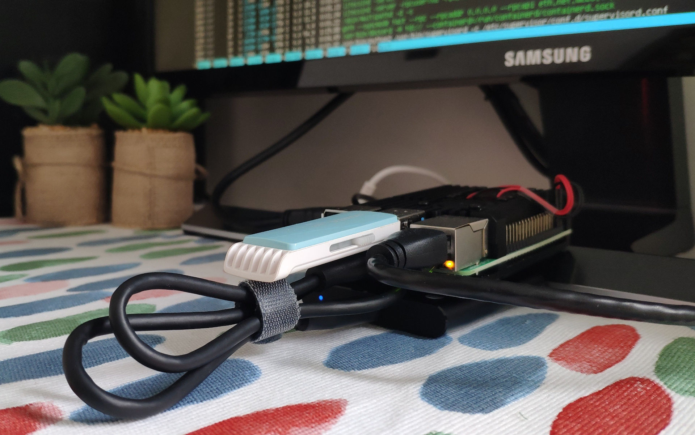

This guide is written for liquidity providers to turn a Raspberry Pi into an always-on OpenDEX node.



Two options are available:

1. **Light setup** using [Neutrino](https://github.com/lightninglabs/neutrino) and a random open eth provider or optionally [Infura](https://infura.io/). This keeps the setup light-weight & cheap, but creates a certain dependency on other people's full nodes. **Supported by all Pi3/4 models.**
2. **Full setup** using [bitcoind](https://github.com/bitcoin/bitcoin/), [litecoind](https://github.com/litecoin-project/litecoin) and [geth](https://github.com/ethereum/go-ethereum). Requires more resources and an SSD, but keeps the setup trustless. **Supported only by the Pi4 with 4GB RAM or more.**

If you are not sure, we recommend to start with the light setup. If you opt for the Pi4 4/8GB, you can switch to the full setup at any time.

## Light Reference Shopping List (Spain): ~65 €
* [Pi3 B+](https://www.tiendatec.es/raspberry-pi/placas-base/752-raspberry-pi-3-modelo-b-plus-713179640259.html): 39,95 €
* [Pi3 B+ Power Supply](https://www.tiendatec.es/raspberry-pi/raspberry-pi-alimentacion/974-fuente-alimentacion-5v-3a-micro-usb-con-interruptor-raspberry-pi-3-8472496015080.html): 6,65 €
* [32GB MicroSD card](https://www.amazon.es/dp/B06XYHN68L/): 15 €
  * A performant microSD card is important; not the right place to save some bucks.
  * For more options, check [this storage benchmark list](https://jamesachambers.com/raspberry-pi-storage-benchmarks/).
* [USB stick for backups](https://www.amazon.es/dp/B00TPG6P22/): 3,99 €
   * Any >1GB USB stick will do.
   * A NAS/Samba share works too.

## Full Reference Shopping List (Spain): ~290 €
* [Pi4 (8GB)](https://www.tiendatec.es/raspberry-pi/placas-base/1231-raspberry-pi-4-modelo-b-8gb-765756931199.html): 82,95 €
* [Pi4 Power Supply](https://www.tiendatec.es/raspberry-pi/raspberry-pi-alimentacion/1093-alimentador-oficial-raspberry-pi-4-usb-c-5v-3a-15w-negro-644824914886.html): 8,95 €
* [Pi4 Cooling Case](https://www.tiendatec.es/raspberry-pi/cajas/1110-caja-cofre-alta-disipacion-con-dos-ventiladores-para-raspberry-pi-4-8472496015950.html): 14,95 €
  * Needed! The Pi4 is a hottie.
* [32GB MicroSD card](https://www.amazon.es/dp/B06XYHN68L/): 15 €
  * A performant microSD card is important; not the right place to save some bucks.
  * For more options, check [this storage benchmark list](https://jamesachambers.com/raspberry-pi-storage-benchmarks/).
* [USB stick for backups](https://www.amazon.es/dp/B00TPG6P22/): 3,99 €
   * Any >1GB USB stick will do.
   * A NAS/Samba share works too.
* [1TB external SSD](https://www.amazon.es/gp/product/B074M774TW/): 165 €
  * **For full setup only, not needed for light setup!**
  * For more options, check [this storage benchmark list](https://jamesachambers.com/raspberry-pi-storage-benchmarks/).

## Pi Basic Setup

1. [Download Ubuntu 20.04 for the Pi](https://ubuntu.com/download/raspberry-pi) onto your computer, choosing **64-bit**. Any other 64-bit (also called `arm64`, `aarch64`, `armv8`) linux os for the Pi is fine too. Systems like [Raspberry Pi OS](https://www.raspberrypi.org/downloads/raspberry-pi-os/), which, at the time of writing, are still based on the 32-bit (`armv7`) architecture , are **not** supported. This guide was written using `Ubuntu 20.04`.
2. Insert the microSD card into your computer and follow the [flash instructions](https://ubuntu.com/download/iot/installation-media).
3. *Optional:* If you don't have a screen, usb keyboard and even an ethernet cable available, you can pre-configure Wifi for a headless setup.
```bash
# on your linux computer, cd to the mounted microSD card partition "writable" and copy the wifi sample file. If you can't see any partition called "writable", then you are probably running something other than linux and need to figure out how to mount an ext4 filesystem.
sudo cp ./usr/share/doc/netplan/examples/wireless.yaml ./etc/netplan/
# open the file to edit
sudo nano ./etc/netplan/wireless.yaml
# strip down the file to the bare minmum for the Pi to get an IP automatically assigned by your router
network:
  version: 2
  wifis:
    wlan0:
      dhcp4: yes
      dhcp6: no
      access-points:
        "<YOUR WIFI SSID>":
          password: "<YOUR WIFI PASSWORD>"
# if you can't access your router to read out your Pi's IP, you can also configure a static IP now
      addresses: [192.168.1.42/24]
      gateway4: 192.168.1.1
      nameservers:
        addresses: [192.168.1.1, 8.8.8.8]
# CTRL+S, CTRL+X.
```
4. Insert the microSD card into your Pi, connect it to your router via ethernet cable and to a power supply. Connecting a screen via HDMI and a USB keyboard makes life easier, but checking the assigned IP in your router and SSHing in from your computer works too.
5. Follow the inital setup instructions. Default user + password is `ubuntu`. You will be asked to change the password on first login.
6. Update ubuntu via `sudo apt update && sudo apt upgrade`
7. If you are using Ubuntu 20.04, install docker & docker-compose by running `sudo apt install docker.io`. Otherwise if you are using any version besides Ubuntu 20.04, follow the [official instructions](https://docs.docker.com/install/linux/docker-ce/ubuntu/) (select `arm64` in step 4 of "Set up the repository") to install docker.
8. Add new user `opendex`:
```bash
ubuntu@ubuntu:~$ sudo adduser opendex
Adding user `opendex' ...
Adding new group `opendex' (1001) ...
Adding new user `opendex' (1001) with group `opendex' ...
Creating home directory `/home/opendex' ...
Copying files from `/etc/skel' ...
New password: 
Retype new password: 
passwd: password updated successfully
Changing the user information for opendexd
Enter the new value, or press ENTER for the default
	Full Name []: 
	Room Number []: 
	Work Phone []: 
	Home Phone []: 
	Other []: 
Is the information correct? [Y/n] ubuntu@ubuntu:~$ Y
```
9. Add the `opendex` user to the sudo group (advanced users can skip this and use another user to run sudo commands), the docker group and test if docker is working:
```bash
ubuntu@ubuntu:~$ sudo usermod -aG sudo opendex
ubuntu@ubuntu:~$ sudo usermod -aG docker opendex
# switch to user opendexd
ubuntu@ubuntu:~$ sudo su - opendex
opendex@ubuntu:~$ docker run hello-world
Hello from Docker!
This message shows that your installation appears to be working correctly.
```
10. Looking good! Optionally, add an alias to enter your opendexd environment by simply typing "opendex":
```bash
opendex@ubuntu:~$ sudo nano ~/.bash_aliases
# add the line
alias opendex='bash ~/opendex.sh'
# CTRL+S, CTRL+X. Then run
opendex@ubuntu:~$ source ~/.bashrc
```
11. Connect the USB stick to your Pi and set it up. It is very important to do this for a mainnet setup (given you do not want to lose money)!
```bash
# check the USB stick's path with
opendex@ubuntu:~$ ls -la /dev/ | grep sd
crw-------  1 root root      2,  61 Dec  3 16:27 ptysd
brw-rw----  1 root disk      8,   0 Dec  3 16:27 sda
brw-rw----  1 root disk      8,   1 Dec  3 16:27 sda1 #this is your USB Stick
crw-------  1 root root      3,  61 Dec  3 16:27 ttysd
# set it to automount via fstab
opendex@ubuntu:~$ sudo nano /etc/fstab
# add the line
/dev/sda1 /media/USB ext4 defaults 0 2
# CTRL+S, CTRL+X. Then mount it
opendex@ubuntu:~$ sudo mkdir /media/USB
opendex@ubuntu:~$ sudo mount -a
# check if mounting worked
opendex@ubuntu:~$ df -h
# make sure opendexd can use it
opendex@ubuntu:~$ sudo chown opendex:opendex /media/USB
```
From here the light and full setup require different settings. Continue choosing one.

## Pi Light Setup

If you are using a Pi model with 2GB of RAM or more, you can continue [here](/docs/liquidity-providers.md#the-setup). If you are using a Pi model with <2GB of RAM, we will have to catch a temporary RAM spike when creating the opendex environment by creating a swap file (overflow RAM) of 2GB on the internal sd card:
```bash
# create the swap file
opendex@ubuntu:~$ sudo fallocate -l 2G /home/opendex/swapfile
# mark it as swap file
opendex@ubuntu:~$ sudo chmod 600 /home/opendex/swapfile && sudo mkswap /home/opendex/swapfile
# enable it
opendex@ubuntu:~$ sudo swapon /home/opendex/swapfile
# set it to automount via fstab
opendex@ubuntu:~$ sudo nano /etc/fstab
# add the line
/home/opendex/swapfile none swap sw 0 0
# # CTRL+S, CTRL+X. Let's verify it's working & reboot
opendex@ubuntu:~$ sudo swapon --show
NAME               TYPE SIZE USED PRIO
/home/opendex/swapfile file  2G   0B   -2
opendex@ubuntu:~$ sudo reboot
# after reboot, let's check if the swapfile is still active
opendex@ubuntu:~$ sudo swapon --show
NAME               TYPE SIZE USED PRIO
/home/opendex/swapfile file  2G   0B   -2
```
Light setup - **DONE!** Continue [here](/docs/liquidity-providers.md#the-setup).

## Pi Full Setup

Connect the SSD to your Pi4 and set it up:
```bash
# let's check the SSD's path
opendex@ubuntu:~$ ls -la /dev/ | grep sd
crw-------  1 root root      2,  61 Dec  3 16:27 ptysd
brw-rw----  1 root disk      8,   0 Dec  3 16:27 sda
brw-rw----  1 root disk      8,   1 Dec  3 16:27 sda1 #this is your USB Stick
brw-rw----  1 root disk      8,  16 Jan 28 10:45 sdb
brw-rw----  1 root disk      8,  17 Jan 28 10:45 sdb1 #this is your SSD
crw-------  1 root root      3,  61 Dec  3 16:27 ttysd
# set it to automount via fstab
opendex@ubuntu:~$ sudo nano /etc/fstab
# add the line
/dev/sdb1 /media/SSD ext4 defaults 0 2
# CTRL+S, CTRL+X. Then mount it
opendex@ubuntu:~$ sudo mkdir /media/SSD
opendex@ubuntu:~$ mount -a
# check if mounting worked
opendex@ubuntu:~$ df -h
# make sure opendexd can use it without sudo privileges
opendex@ubuntu:~$ sudo chown opendexd:opendexd /media/SSD
```
Let's do a quick performance test of the SSD. If you are close to these values, you are good to go, whereas <100 MB/s would be too slow:
```bash
opendex@ubuntu:~$ sudo dd if=/dev/zero  of=/media/SSD/deleteme.dat bs=32M count=64 oflag=direct
64+0 records in
64+0 records out
2147483648 bytes (2.1 GB, 2.0 GiB) copied, 12.8709 s, 167 MB/s
opendex@ubuntu:~$ sudo dd if=/media/SSD/deleteme.dat of=/dev/null bs=32M count=64 iflag=direct
64+0 records in
64+0 records out
2147483648 bytes (2.1 GB, 2.0 GiB) copied, 15.5791 s, 138 MB/s
opendex@ubuntu:~$ sudo rm /media/SSD/deleteme.dat
```
Important: geth needs loads of RAM when syncing, so we need to create a swap file (overflow RAM) of 8GB on the external SSD:
```bash
# create a swap file on the SSD, we recommend a size of 8GB
opendex@ubuntu:~$ sudo fallocate -l 8G /media/SSD/swapfile
# mark it as swap file
opendex@ubuntu:~$ sudo chmod 600 /media/SSD/swapfile && sudo mkswap /media/SSD/swapfile
# enable it
opendex@ubuntu:~$ sudo swapon /media/SSD/swapfile
# set it to automount via fstab
opendex@ubuntu:~$ sudo nano /etc/fstab
# add the line
/media/SSD/swapfile none swap sw 0 0
# # CTRL+S, CTRL+X. Let's verify it's working & reboot
opendex@ubuntu:~$ sudo swapon --show
NAME               TYPE SIZE USED PRIO
/media/SSD/swapfile file  8G   0B   -2
opendex@ubuntu:~$ sudo reboot
# after reboot, let's check if the swapfile is still active
opendex@ubuntu:~$ sudo swapon --show
NAME               TYPE SIZE USED PRIO
/media/SSD/swapfile file  8G   0B   -2
```
Full setup - **DONE!** Continue [here](/docs/liquidity-providers.md#the-setup).
